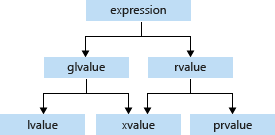

# Lvalues and Rvalues

## 定义

左值和右值

C++17标准定义了表达式的值类别如下：

- glvalue 泛左值

  > is an expression whose evaluation determines the identity of an object, bit-field, or function.

  是一个表达式，其值可确定某个对象或函数的标识。

- prvalue 纯右值
  
  > is an expression whose evaluation initializes an object or a bit-field, or computes the value of the operand of an operator, as specified by the context in which it appears.

  根据其出现的上下文，初始化一个对象或者位域，或者计算一个运算符的操作数的值。

- xvalue 亡值

  > is a glvalue that denotes an object or bit-field whose resources can be reused (usually because it is near the end of its lifetime). Example: Certain kinds of expressions involving rvalue references yield xvalues, such as a call to a function whose return type is an rvalue reference or a cast to an rvalue reference type.

  xvalue 是一个 glvalue，表示其资源可以重复使用（通常是因为其生命周期即将结束）的对象或位域。例如：某些涉及右值引用的表达式会产生xvalues，比如*调用返回类型为右值引用的函数* 或者 *转换到右值引用类型*

- lvalue

  不是亡值的泛左值

- rvalue

  纯右值或者亡值

## 简短的阐述



一个左值会拥有一个你的程序可访问的地址。左值表达式包括：变量名，const 变量，数组元素，调用返回左值引用的函数，位域，联合体，或者类成员。

一个纯右值表达式不存在（或拥有一个合法的方式）去访问其地址。纯右值表达式的例子有，字面量，调用返回值是不含引用的类型的函数，在表达式评估过程中产生的仅由编译器可以访问的临时对象。

亡值表达式的地址不再能被程序访问，但是可以被用来初始化一个右值引用，从而提供对表达式的访问。例如，调用返回右值引用的函数，数组下标访问，右值引用类型的数组或者对象的成员或者成员指针

## 总结

最早是根据是否是identity和moveable来分类。

- “has identity” – i.e. and address, a pointer, the user can determine whether two copies are
identical, etc.
- “can be moved from” – i.e. we are allowed to leave to source of a “copy” in some indeterminate,
but valid state

```txt
iM  im  Im
  \/  \/
  i    m
```

- iM: has identity and cannot be moved from
- im: has identity and can be moved from (e.g. the result of casting an lvalue to a rvalue
reference)
- Im: does not have identity and can be moved from

> Every value is either an lvalue or an rvalue.

一个表达式的值只可能是*左值*或者*右值*，或者*泛左值*和*纯右值*。

拥有身份的表达式被称作“泛左值 (glvalue) 表达式”。左值和亡值都是泛左值表达式。可被移动的表达式被称作“右值 (rvalue) 表达式”。纯右值和亡值都是右值表达式。

> An lvalue is not an rvalue and an rvalue is not an lvalue.

我们讨论的比较多的一般还是指泛左值和纯右值，即glvalue和prvalue。

C++17 有场合要求*复制消除*(copy elision)，纯右值已不可再被移动。
