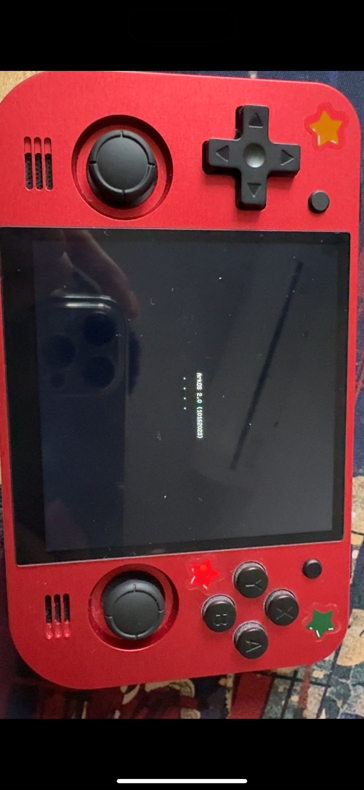
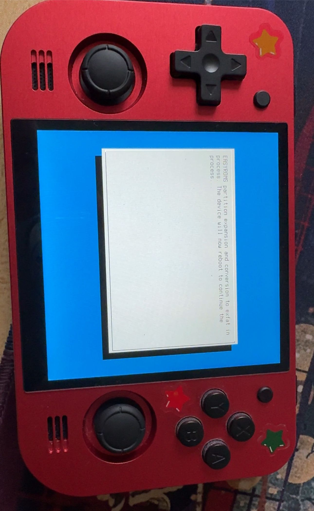
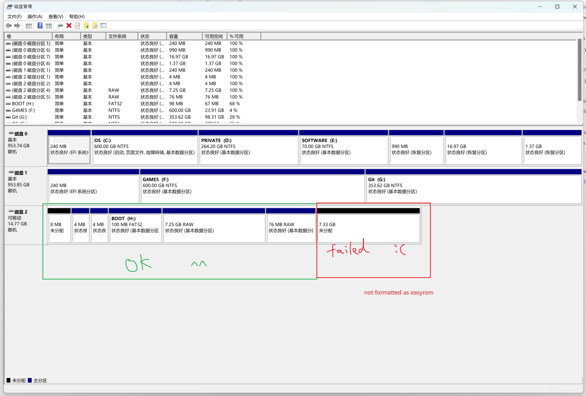
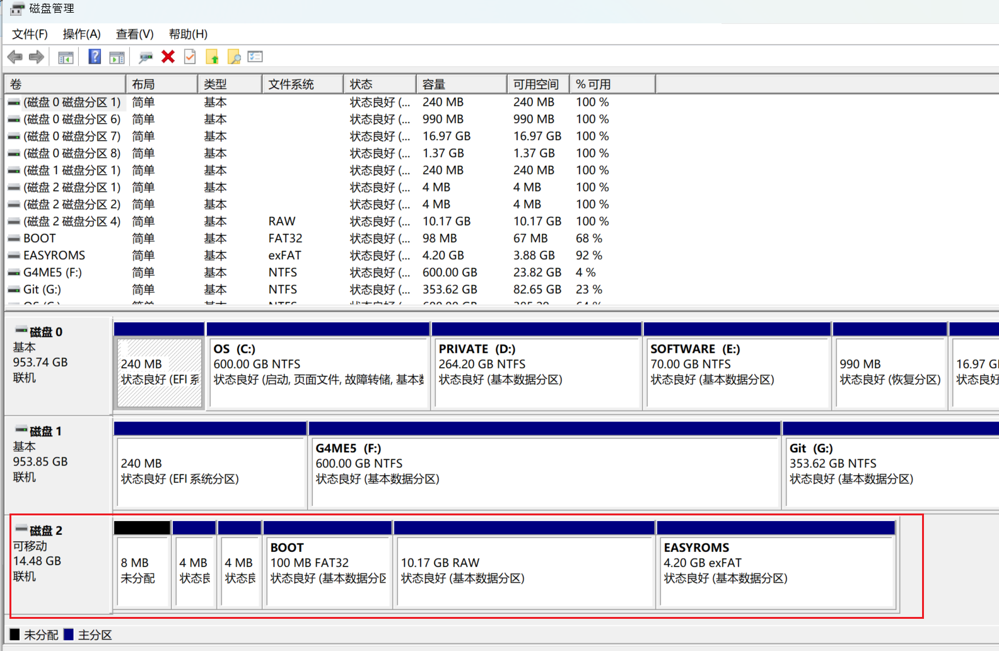
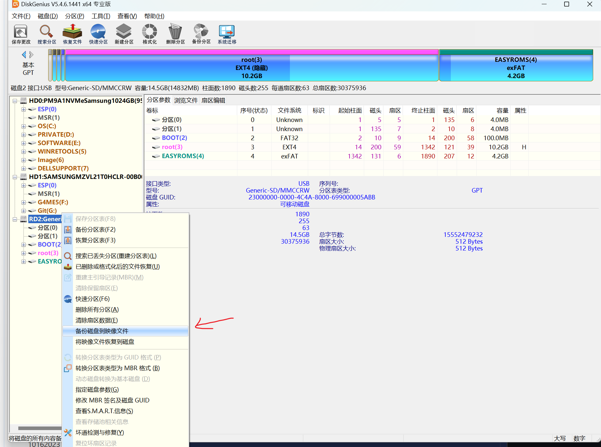
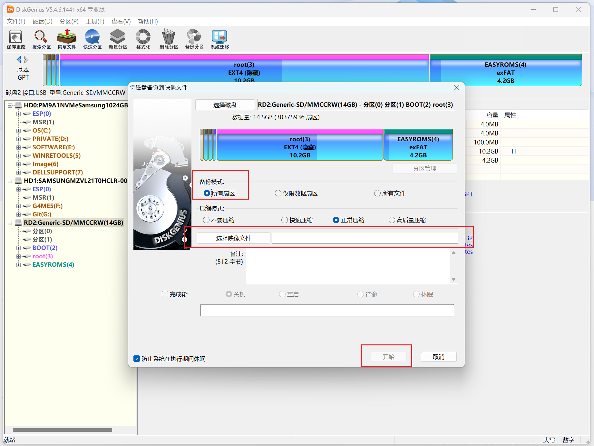
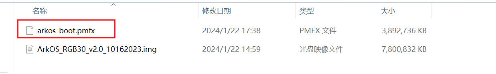

# ArkOS Failed On PowKiddy RGB30

I've got a PowKiddy RGB30 recently and trying to install ArkOS for better performance on PSX. 

I followed the tutorial on [ArkOS Wiki](https://github.com/christianhaitian/arkos/wiki), downloaded the image for rgb30 and flashing it into the sdcard.

Error occured, on booting the OS.

## Issue Description

The first time I insert the sd card and launch the rgb30, the *ArkOS* logo appeared, indicated that it could successfully boot.

The OS then tried to format the **EASYROM** disk partition:

unfortunately, that's all. It automatically reboot after a short stuck, and nothing would happen ever, falling into endless dark with the green light on. (I cover the light with a red star sticker because the light is so dazzling)

No matter how many times you reboot the machine, there is no response on it. Got the same result even if I reflashing the sdcard and ArkOS and repeating the process above again and again.

I checked the disk status of the sdcard, It shows:

Just failed.

## A Really Rude Solution

I'm pretty sure that this 16g sdcard of *sandisk* doesn't have any quality problem because I flashed the Jelos in it and it worked well.

I found another uesless sdcard and tried to install ArkOS again on it. After the second picture showed above, it ran further and successfully formatted the disk partition then launched into ArkOS.

I don't know why this sd card works fine on ArkOS but the previous not.

So I tried a way to mirror the structure and data of the normally-worked card to previous card. Wrote the totally same data, bit to bit.

And it worked, succeeded in booting. Here I'll list the operations that I've done. Hope it does also work for you.

### Preperations

1. Disk Genius (must)

    Used for dumping the disk to an image and restoring the image to another disk.

2. Rufus (alternative)

    Flash the os image. Could be replaced by others.

### Dump Disk Image

1. Follow the [ArkOS Wiki](https://github.com/christianhaitian/arkos/wiki), flash the Arkos to the sdcard.

2. Inserted it into the rgb30 and finish the operations when first boot. The layout of the disk should be:

    

3. Open Disk Genius, right click your disk, and select:

    

    Mine is Chinese, you can chekck it [here](https://www.diskgenius.com/manual/backup-disk-to-image-file.php) in English. And check this on, select a place where to save the dumped disk image on your computer.

    
    
    The dg image file(.pmfx) looks like this:

    

### Restore To Any Another SDCard

1. Insert the to-be-restored sdcard in your computer. 

2. Open Disk Genius and Deleted all partitions on it. Must ensure that it was totally empty and not formatted. Then click the left-right corner botton on disk genius to save the changes.

3. right click your disk, and select the [restore-disk-from-image-file](https://www.diskgenius.com/manual/restore-disk-from-image-file.php). (Just one line below the arrow of the picture). Then find the image that you dumped before and restore from it.

4. Wait till the operation finished. Notice if there's any error occur. If errors raised you need to repeat the operations from step 2, erase it and redo.

5. unplug the sdcard and insert it into rgb30. The device should be properly booted and will launch the ArkOS.

## End

I rebooted several times and played games for hours, it worked pretty well and seems stable. No crash, no stuck. Also tested wifi and online update successfully.

If you don't have any sdcard that could properly boot the ArkOS . I could upload my dumped disk image, the *.pmfx* file, for you if needed. Just restore the image to your sdcards with disk genius should also works well.

At least I can found the stable way to install the arkos..
